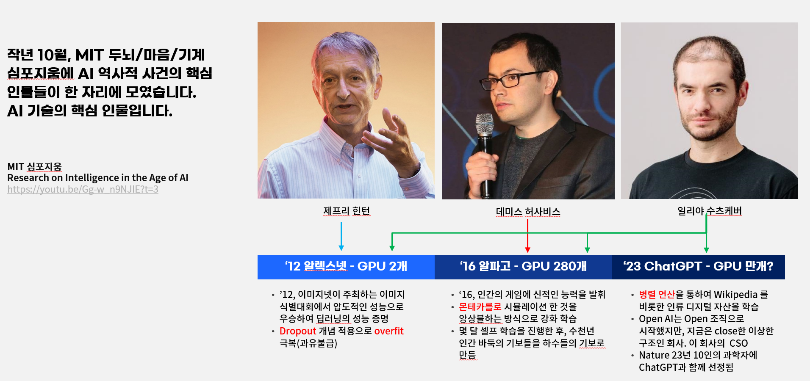

In October last year, key figures in AI gathered at MIT. See the discussion: [Research on Intelligence in the Age of AI]( https://youtu.be/Gg-w_n9NJIE?t=3 ).

---
### Video overview (Korean)

<iframe width="1000" height="700" src="https://www.youtube.com/embed/fGI8_oTjKsU?si=FrpS4MNfIDccnQJd&amp;controls=0&autoplay=1&mute=1&controls=0&loop=1" title="YouTube video player" frameborder="0" allow="accelerometer; autoplay; clipboard-write; encrypted-media; gyroscope; picture-in-picture; web-share" allowfullscreen></iframe>

---

