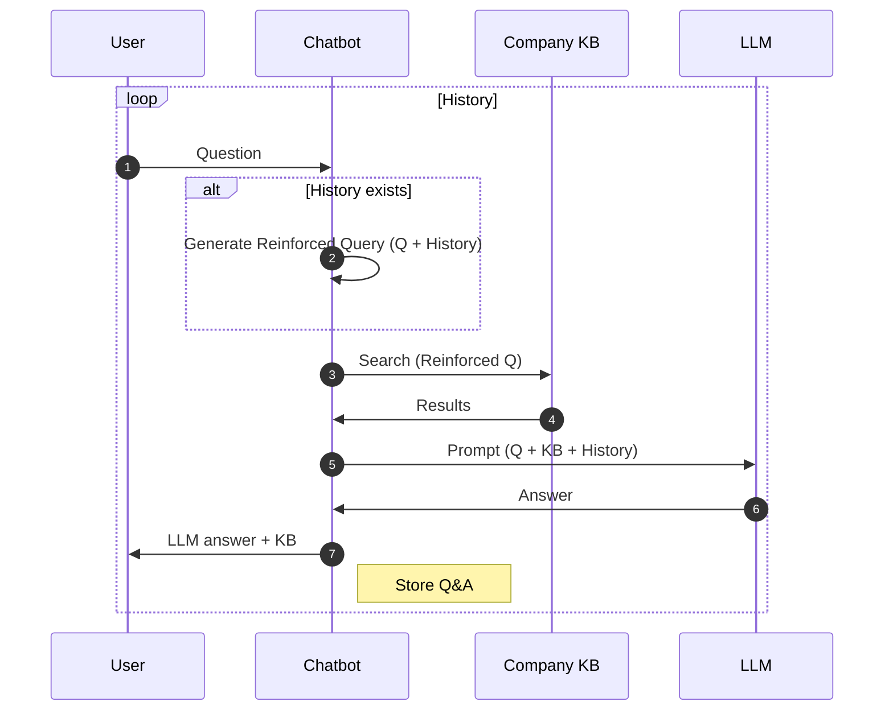

Below is a basic sequence for answering user questions with company knowledge and LLM.

```mermaid
sequenceDiagram
    autonumber
    loop History

    User->>Chatbot: Question

    alt History exists
        Chatbot->>Chatbot: Generate Reinforced Query (Q + History)
    end

    Chatbot->>Company KB: Search (Reinforced Q)
    Company KB->>Chatbot: Results
    
    Chatbot->>LLM: Prompt (Q + KB + History)
    LLM->>Chatbot: Answer

    Chatbot->>User: LLM answer + KB
    Note right of Chatbot: Store Q&A

    end
```

> Details may vary by options.

