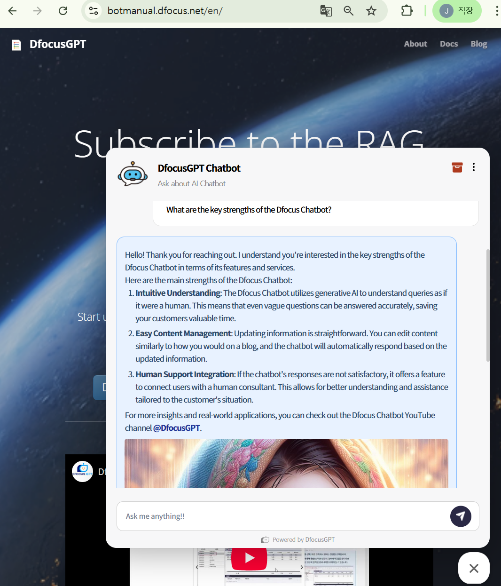
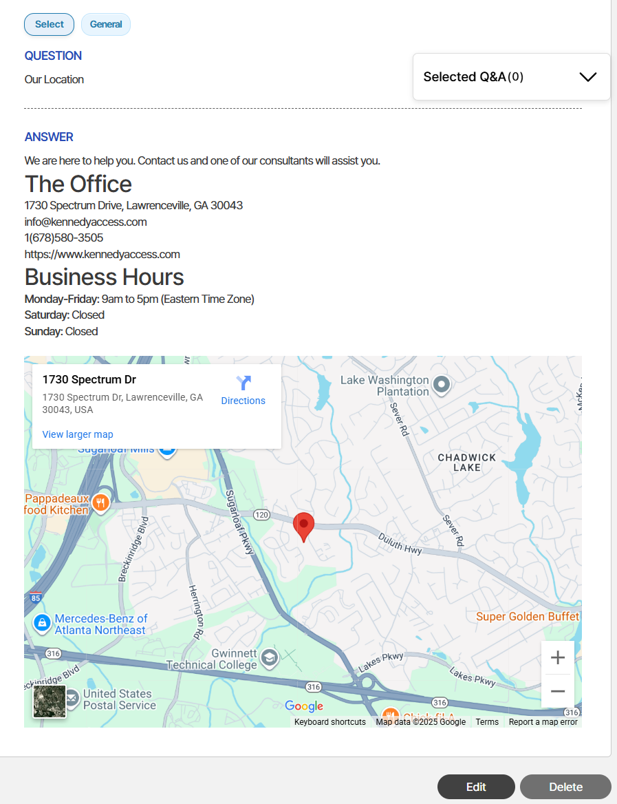
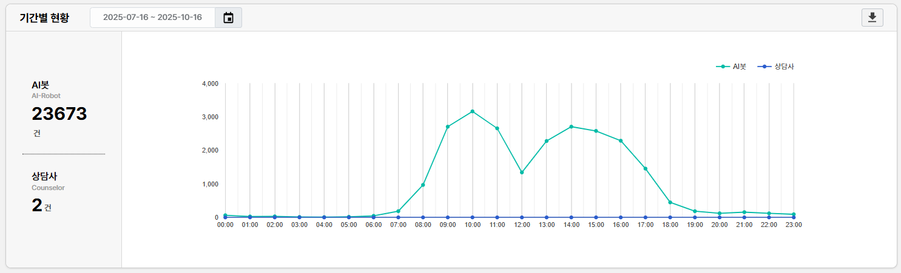

> DfocusGPT 0.9 provides the following features.

## Feature updates

1. Chatbot
2. Knowledge management
3. Agent handoff
4. Reports

### Chatbot

### Knowledge management

### Agent handoff

### Reports
Chat statistics and dashboard image.

1. 500 responses per a day for a small ERP solution. And AI assistant won't be tired. Never!

2. 9 to 6 and plus alpha. 

