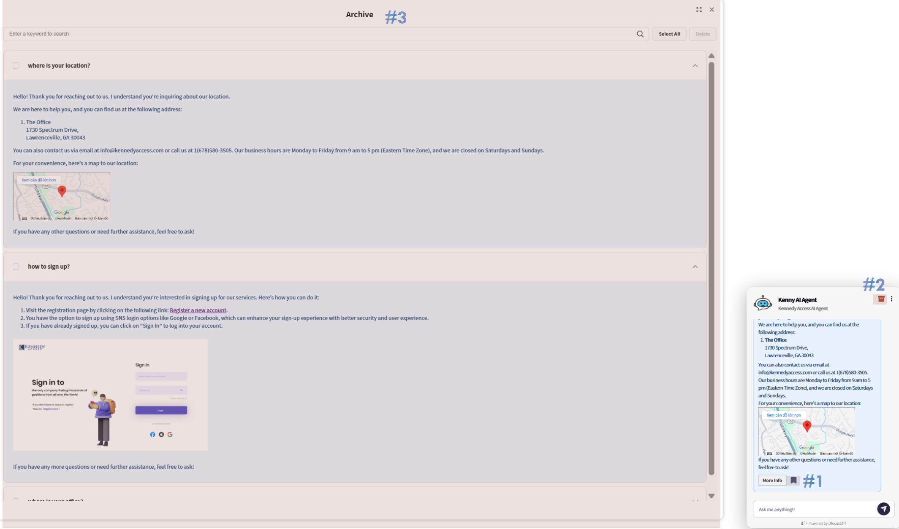

> DfocusGPT 1.1 provides the following features.

## Feature updates

1. Support assigning and filtering types for each FAQ Q&A.
2. Multilingual: set the display language and the answer language. Display supports English and Korean; answer language is unrestricted.
3. Archive option: users can bookmark answers and revisit them later.
4. Per-category customization for chatbot size and button icons.
5. Semantic search option using vector similarity in knowledge management.
6. Added a recommended Q&A page to help generate FAQs.

**3. Archive option** — When satisfied with an answer, press the bookmark (#1) icon to save it. Saved answers are available anytime from the Archive (#2) icon, which opens the saved conversations list (#3).

