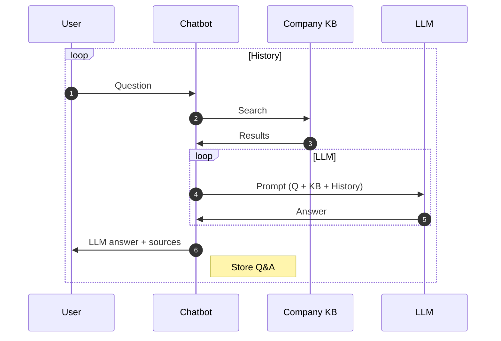

1. Narrow the knowledge gap – make organizational knowledge instantly accessible.
2. Instant service – deliver answers quickly via an AI chatbot.
3. Keep it intuitive – provide only what’s needed at a fair price.

Below is a basic sequence of how user questions are answered.

> Flows may vary by options. Agent handoff and KB management flows are similar.

