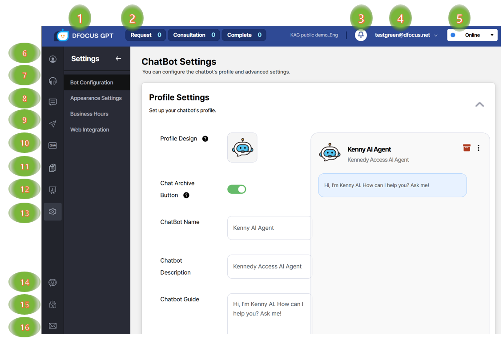
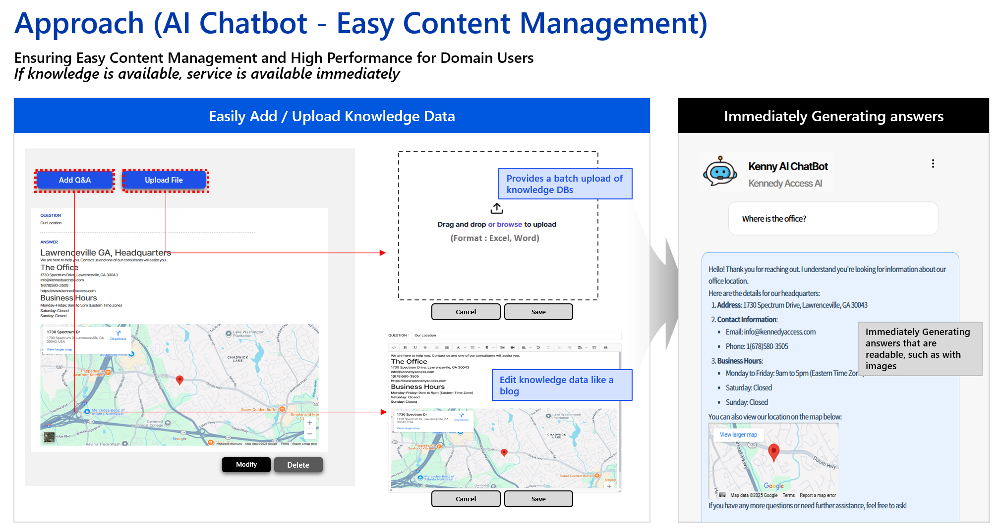

{}
Tooltips on each icon describe the menu items.
{}

1. Logo – returns to the home screen.
2. Calls – pending, active, and finished agent calls.
3. Notifications – async task notifications (e.g., upload complete).
4. User – email menu with password change, logout, category switch.
5. Status – set agent status (busy, offline, etc.).
6. Agent management – add agents, set nicknames/brands.
7. [Consulting]() – view user info and chat history; respond appropriately.
8. Chat history – user, bot, and agent conversations.
9. Internal messenger – chat between signed‑in agents.
10. [Q&A Management]() – manage sources for chatbot answers.
11. Recommended QA - from bulk text typed(or copied or upload), generate some recommedded FAQ and add it into Q&A database.
12. Analytics – dashboards for load, sessions by agent/category, usage details.
13. Settings – default phrases, working hours, and embed scripts.
14. [Chatbot testing]() – test performance after entering knowledge.
15. Inquiries – view your submitted requests.
16. Contact – submit quick questions while using the system.

### Intuitive admin UI

1. Bulk upload searchable Word documents with images; edit entries easily.
2. Build a dedicated “manual‑style” chatbot window that renders images nicely.

