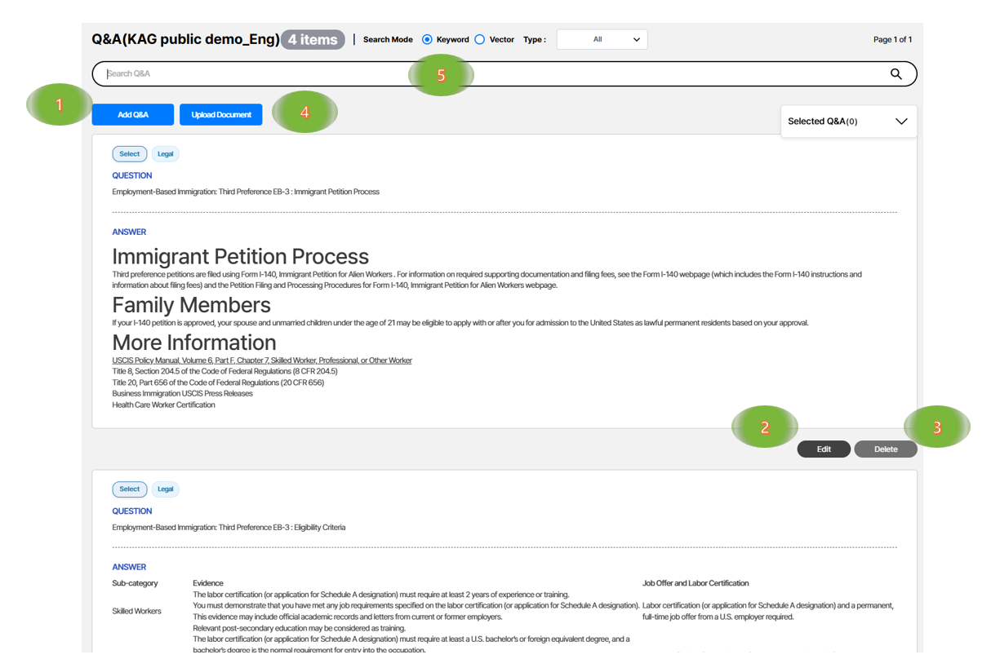
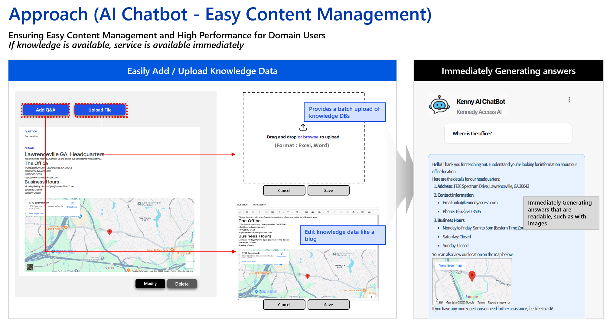

{}
Manage frequently asked questions and their answers.
{}

1. Add – create an FAQ.
2. Edit – modify an FAQ.
3. Delete – remove an FAQ.
4. Upload documents – see Bulk Upload.
5. Search – keyword/Semantic matching.

### Intuitive and convenient Q&A management

1. Bulk upload and edit Word documents with images.
2. Generate readable answers like “manuals with images”.
3. Streaming answers minimize perceived latency.

