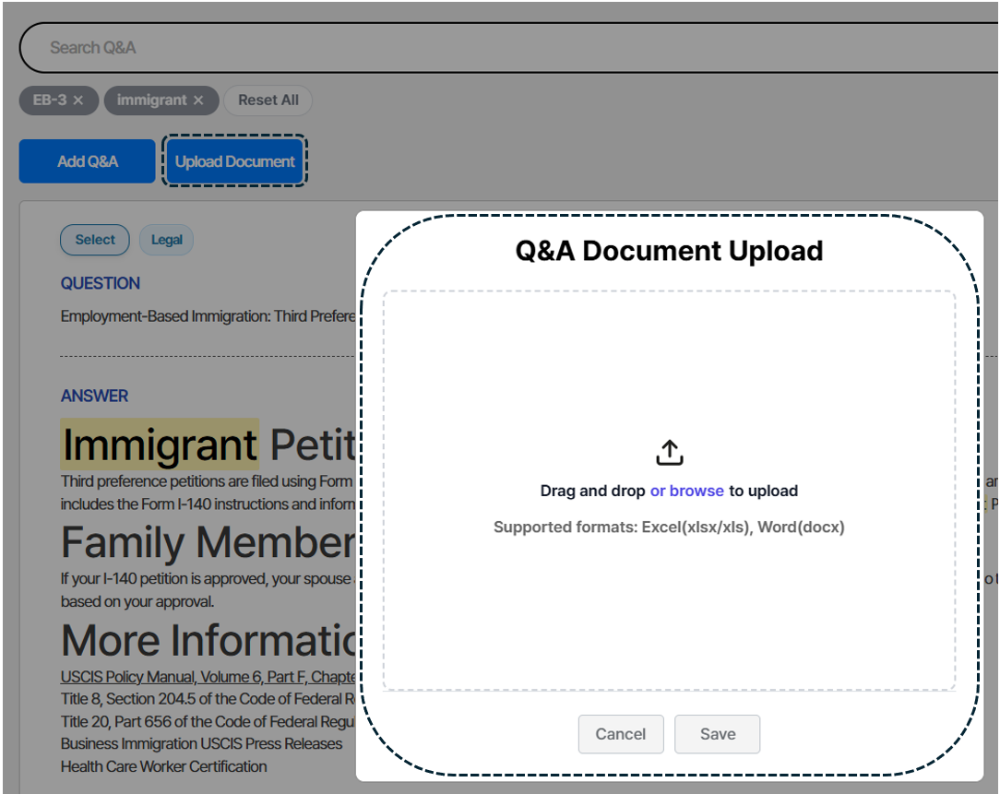

{}
Bulk uploads must follow the required formats.
{}

1. Excel files must be Question/Answer pairs (Q in the first column, A in the second).
2. Word files also follow Q/A pairs. See the Word section.

After preparing the file, click “Upload Document” and select your file.

