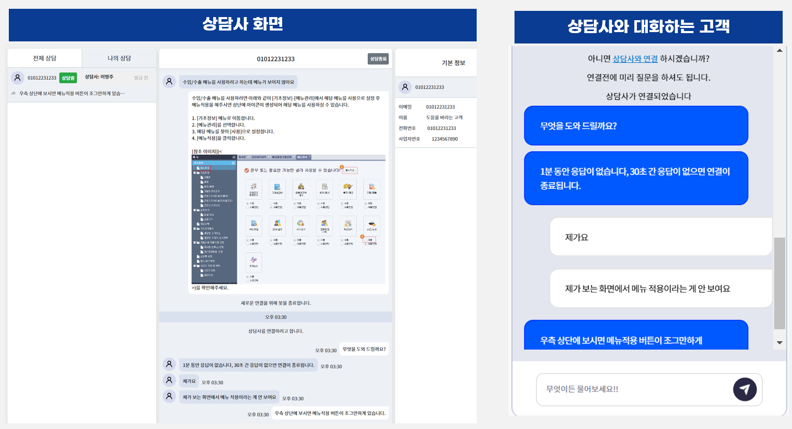
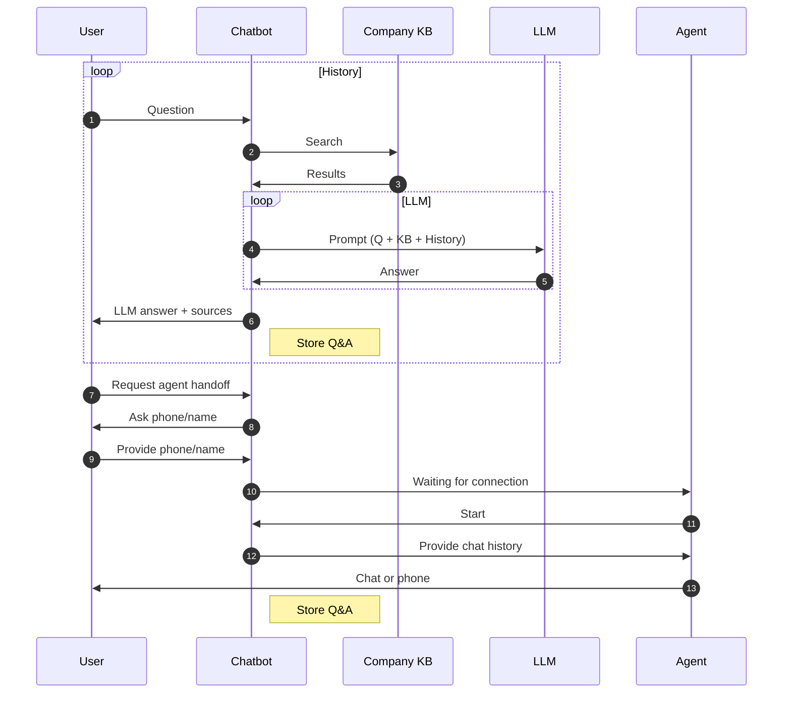

{}
When a user requests agent handoff, an agent connects automatically or manually and continues the chat.
{}

1. The user selects “Connect to agent”.
2. The agent starts the session from the waiting list.
3. The middle panel shows the prior user–bot conversation.
4. The user sees “Agent connected”.
5. The agent chats with the user.

Video demo (Korean):

<iframe width="1000" height="700" src="https://www.youtube.com/embed/RW-2kjcbLGI?si=zoV89iY3H3PNS7yk&amp;controls=0&autoplay=1&mute=0&controls=0&loop=1&playlist=RW-2kjcbLGI" title="YouTube video player" frameborder="0" allow="accelerometer; autoplay; clipboard-write; encrypted-media; gyroscope; picture-in-picture; web-share" allowfullscreen></iframe>
