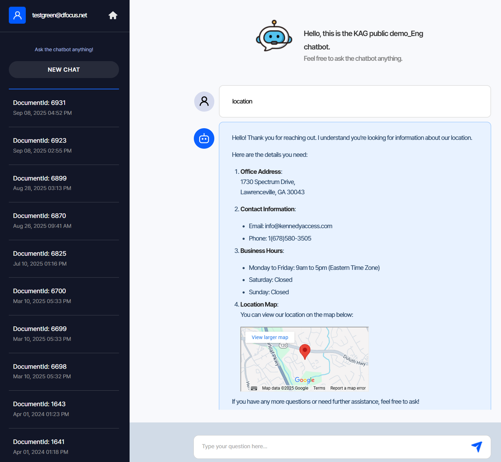
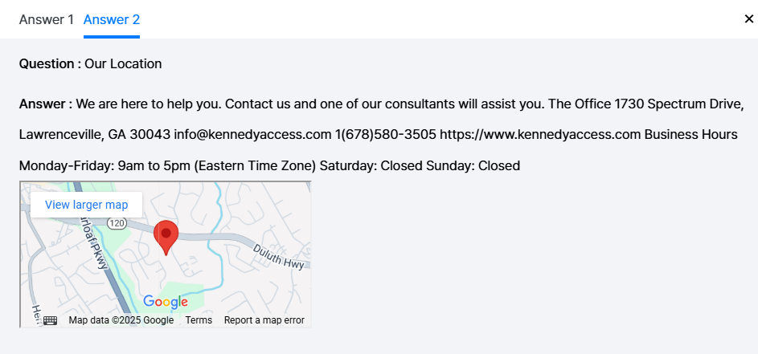

{}
After organizing knowledge, test the chatbot with various questions.
{}

1. Left panel shows “New chat” and chat history.
2. Type your question and press Enter or click the paper‑plane icon to start.
3. Q&A is saved to history automatically.

Click “More info” under an answer to see the sources referenced by the chatbot.

