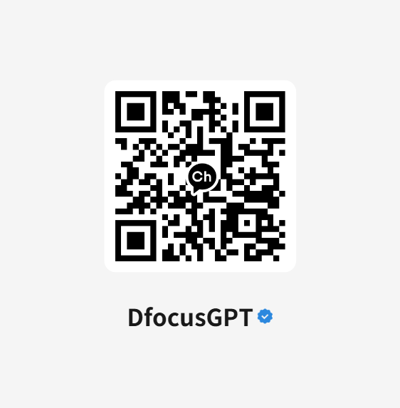



<!-- Google tag (gtag.js) -->





    

        

            

                고되고 반복된 업무에 지쳐가기만 하는 당신의 정신 건강은?
            

            

                무한 대기로 지친 고객에게 인공지능 챗봇의 신속한 답변을 제공할 수 있다면?
            

            

                누구나 간편하게 등록하고 관리할 수 있는 <strong>DfocusGPT</strong>를 구독서비스로 바로 이용.
            

        

    

<a class="btn btn-lg btn-primary me-3 mb-4" href="/docs/">
  설명서 <i class="fas fa-arrow-alt-circle-right ms-2"></i>
</a>
<a class="btn btn-lg btn-secondary me-3 mb-4" href="https://dfocus.net">IT 기업봇<i class="fas fa-arrow-alt-circle-right ms-2"></i>
</a>
<a class="btn btn-lg btn-secondary me-3 mb-4" href="https://iquest.co.kr">ERP 상담<i class="fas fa-arrow-alt-circle-right ms-2"></i>
</a>
<a class="btn btn-lg btn-secondary me-3 mb-4" href="https://dfocusgpt.dfocus.net">Shop<i class="fas fa-arrow-alt-circle-right ms-1"></i>
</a>




----------------

<!-- 얼마에요 erp 챗봇 -->


<!-- <iframe width="1200" height="700" src="https://www.youtube.com/embed/Dy9Ff2lSHo8?autoplay=1&mute=1&loop=1&si=XR18xov-L-WxMXqV" title="YouTube video player" frameborder="0" allow="accelerometer; autoplay; clipboard-write; encrypted-media; gyroscope; picture-in-picture; web-share" referrerpolicy="strict-origin-when-cross-origin" allowfullscreen></iframe> -->

<!-- <iframe width="1000" height="700" src="https://www.youtube.com/embed/DOLJ-urTp94?si=yZqG3qrT7wSWR3T2&amp;controls=0&autoplay=1&mute=1&controls=0&loop=1&playlist=DOLJ-urTp94" title="YouTube video player" frameborder="0" allow="accelerometer; autoplay; clipboard-write; encrypted-media; gyroscope; picture-in-picture; web-share" allowfullscreen></iframe> -->

<!-- <iframe width="1200" height="700" src="https://www.youtube.com/embed/5TI8xB7ti40?si=wY7lkeQ9Oir_zJWY&amp;controls=0&autoplay=1&mute=1&controls=0&loop=1" title="YouTube video player" frameborder="0" allow="accelerometer; autoplay; clipboard-write; encrypted-media; gyroscope; picture-in-picture; web-share" referrerpolicy="strict-origin-when-cross-origin" allowfullscreen></iframe> -->

----------------

 바로 시작하세요 &mdash; 클라우드 서비스로!




{}
DfocusGPT 챗봇은 힘들고 나아지지 않는 반복된 업무에 지쳐가기만 하는 당신의 정신 건강에 새로운 희망입니다. 단순하고 반복되는 문의에 대한 답변은 챗봇에게 넘기세요. 간편하게 설정하는 **DfocusGPT** 는 바로 이용할 수 있습니다!.

{}

{}

{}
DfocusGPT는 새로운 코딩 작업이나 전문 지식이 필요하지 않습니다. 
업무 매뉴얼 담당자가 그대로 인공지능 상담봇의 지식 정보 관리를 담당합니다. 블로그 관리보다 더 쉬운 지식 관리를 제공하는 **DfocusGPT**입니다.

{}

{}
블로그 관리보다 쉬운 매뉴얼 관리 기능을 제공합니다. 이미지를 포함한 웹페이지 붙여 넣기와 일괄 업로드도 지원합니다.
{}

{}
디포커스 페이스북에서 다른 솔루션 정보도 살펴 보세요.
{}

{}

{}
<a class="btn btn-lg btn-primary me-3 mb-4" href="/docs/">
  DfocusGPT 매뉴얼 가이드는 여기를 클릭하세요<i class="fab ms-2 "></i>
</a>
{}

{}

<!-- {}
DfocusGPT 앱 - 준비중!
{} -->

{}
디포커스 챗봇 유튜브에서 RAG 챗봇의 기본 개념부터 DfocusGPT 사용 방법과 사례까지 확인하세요!
{}

{}
 디포커스 챗봇 공식 채널입니다  
{}

{}

<!--  -->

{}

{}

