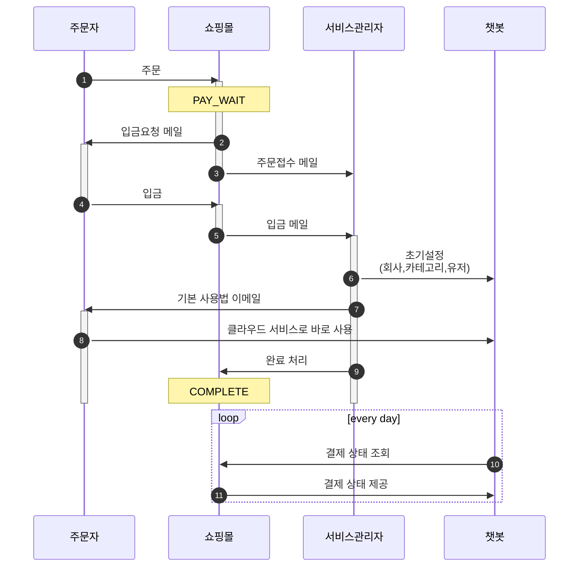

아래 DfocusGPT 챗봇을 주문하시는 고객과 운영의 기본 프로세스입니다. 아래 imweb 사이트 기준의 설명입니다. 쇼핑몰 작업 진행 중입니다. 

```mermaid
sequenceDiagram
    autonumber
    주문자->>쇼핑몰: 주문
    activate 쇼핑몰
    Note over 쇼핑몰: PAY_WAIT
    쇼핑몰->>주문자: 입금요청 메일
    activate 주문자
    쇼핑몰->>서비스관리자: 주문접수 메일
    deactivate 쇼핑몰
    주문자->>쇼핑몰: 입금
    deactivate 주문자
    activate 쇼핑몰
    쇼핑몰->>서비스관리자:입금 메일
    deactivate 쇼핑몰
    activate 서비스관리자
    서비스관리자->>챗봇: 초기설정<br />(회사,카테고리,유저)
    서비스관리자->>주문자: 기본 사용법 이메일
    activate 주문자
    주문자->>챗봇: 클라우드 서비스로 바로 사용
    서비스관리자->>쇼핑몰: 완료 처리
    Note over 쇼핑몰: COMPLETE
    deactivate 서비스관리자
    deactivate 주문자
    loop every day
      챗봇->>쇼핑몰: 결제 상태 조회
      쇼핑몰->>챗봇: 결제 상태 제공
    end
```

> 상기 주문/결제/서비스개시에서 초기설정 부분은 서비스관리자가 진행하고 있습니다. 빠르게 사용하기를 원하시는 경우, gptsupport@dfocus.net로 메일을 넣어 주세요. 

