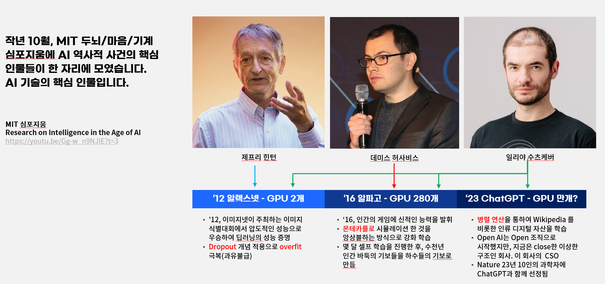

작년 10월, MIT 두뇌/마음/기계 심포지움에 AI 역사적 사건의 핵심 인물들이 한 자리에 모였습니다. [Research on Intelligence in the Age of AI]( https://youtu.be/Gg-w_n9NJIE?t=3 )에서 힌튼과 허사비스 일리아가 인공지능의 현재와 미래에 대하여 고민을 이야기하고 있습니다.

----------------
# 딥러닝의 역사에 대한 유튜브 해설입니다.

<iframe width="1000" height="700" src="https://www.youtube.com/embed/fGI8_oTjKsU?si=FrpS4MNfIDccnQJd&amp;controls=0&autoplay=1&mute=1&controls=0&loop=1" title="YouTube video player" frameborder="0" allow="accelerometer; autoplay; clipboard-write; encrypted-media; gyroscope; picture-in-picture; web-share" allowfullscreen></iframe>

----------------
