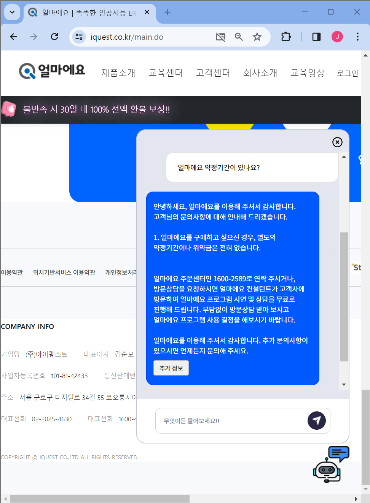
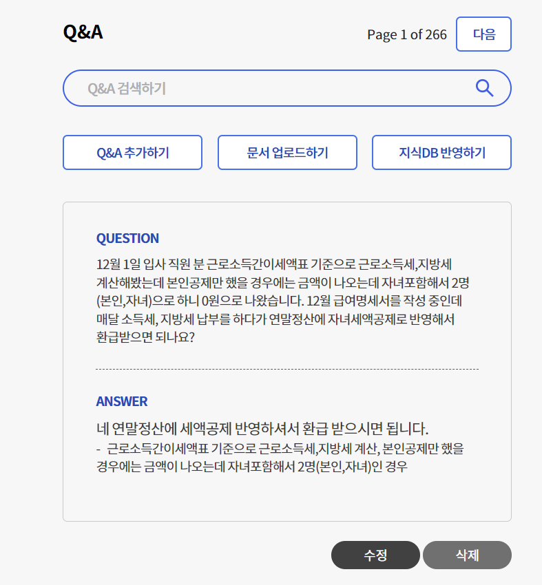
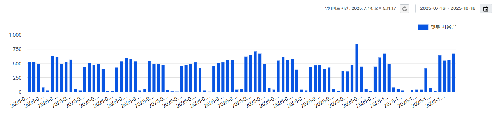
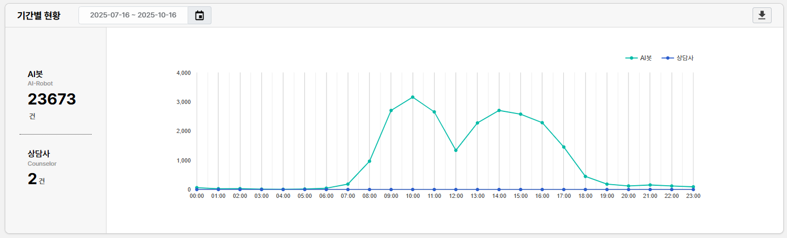

> DfocusGPT 0.9 버전은 다음의 기능을 제공합니다.

## 기능 업데이트 

1. 챗봇 기능 
2. 지식 정보 관리 기능
3. 상담사 기능 
4. 통계 리포트 기능

## 챗봇 기능 ##

고객 사이트에서 챗봇을 사용하는 예시입니다.

## 지식 정보 관리 기능 ##

지식정보의 관리기능을 제공합니다.

## 상담사 기능 ##

상담사 연결 기능을 제공합니다.


## 통계 리포트 기능 ##

챗봇의 상담에 대한 히스토리 분석 및 평가 기능을 제공합니다.

1. 일별 상담 정보입니다. 하루 500건 이상의 요청을 처리하고 있습니다. 심지어 2025년 추석 기간에도 쉬지 않습니다.

2. 9 to 6 뿐만 아니라, 새벽/점심/야간에도 고객 요청에 맞춤형 답변을 자동으로 제공합니다.
