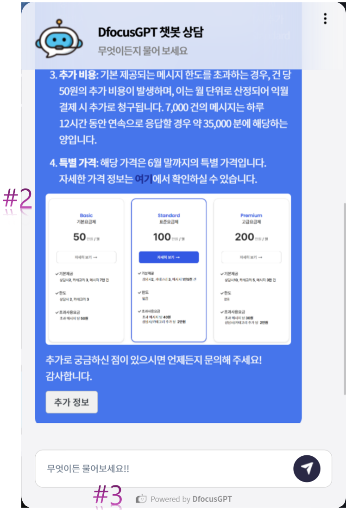

> DfocusGPT 1.0 버전은 다음의 기능을 제공합니다.

## 기능 업데이트 

1. http2 지원으로 성능이 더욱 향상되었습니다.
2. markdown2html은 이미지를 포함한 답변을 더욱 유려하게 표현.
3. 챗봇에 현재 홈페이지로 바로 올 수 있는 링크 추가.
4. 카카오 비지니스 채널에서 DfocusGPT 챗봇 상담을 시작합니다.

**#2는 챗봇 응답의 가독성을, #3는 매뉴얼 홈페이지에 대한 직접적인 접근을 지원합니다.**

