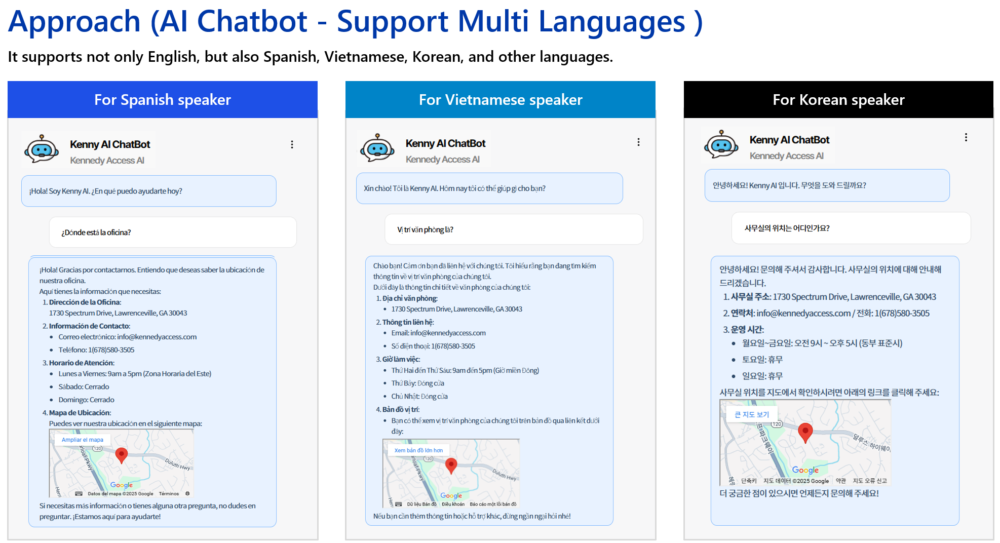
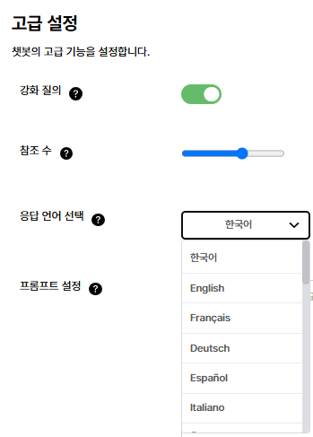
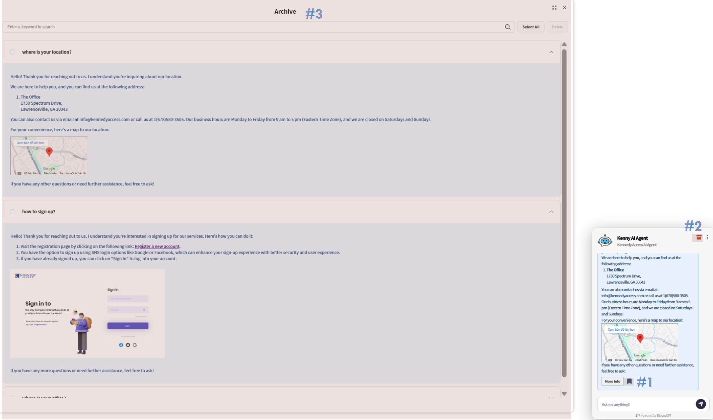
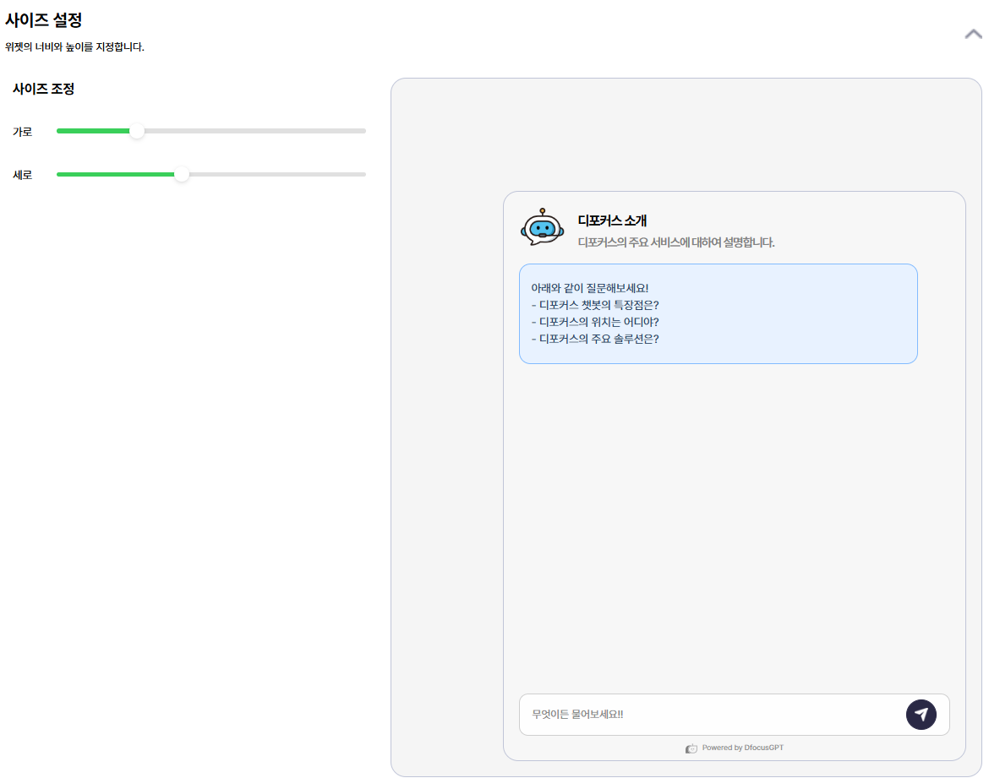
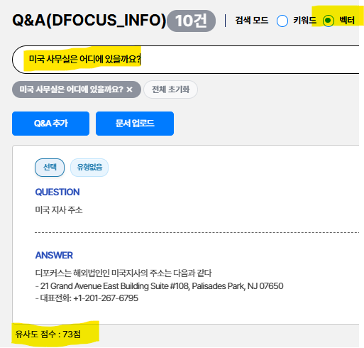

> DfocusGPT 1.1 버전은 다음의 기능을 제공합니다.

## 기능 업데이트 

1. FAQ에서 각 QA에 유형 지정 및 조회를 지원
2. 다국어 기능을 지원 - a. 표시 언어, b. 답변 언어를 설정합니다. * 표시 언어는 영어와 한국어를 지원하고, 답변 언어는 제한이 없습니다.
3. 보관함 옵션 - 각 챗봇 사용자 별로 북마크한 대화를 보관 및 열람하는 기능을 지원
4. 챗봇 사이즈 및 버튼 아이콘을 카테고리 별로 다르게 설정하는 기능 지원
5. 지식 정보 관리에서 벡터 유사도를 이용한 자연어 의미 검색 옵션 지원
6. FAQ 생성을 위한 추천 QA 페이지 추가

**2. 다국어 기능을 지원** - a. 표시 언어, b. 답변 언어를 설정합니다. * 표시 언어는 영어와 한국어를 지원하고, 답변 언어는 제한이 없습니다.

**3. 보관함 옵션** - 만족스러운 답변은 북마크(*#1*) 아이콘을 눌려 저장할 수 있다. 저장된 답변은 보관함(*#2*) 아이콘을 누르면 나타나는 저장된 대화 리스트(*#3*)에서 언제든지 확인이 가능하다.

**4. 챗봇 사이즈 설정** 챗봇 사이즈 및 버튼 아이콘을 카테고리 별로 다르게 설정하는 기능 지원

**5. 자연어 의미 검색** 지식 정보 관리에서 벡터 유사도를 이용한 자연어 의미 검색 옵션 지원

